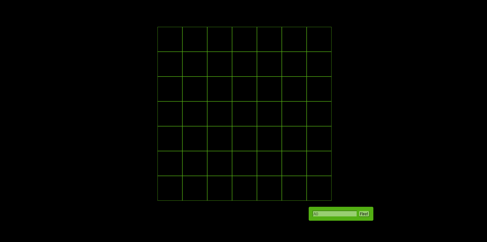

# Battleship Game

This is a prototype of a battleship game, build with HTML, CSS and the logic of the game with JavaScript. 
## Table of contents

- [Overview](#overview)
  - [The challenge](#the-challenge)
  - [Screenshot](#screenshot)
  - [Links](#links)
- [My process](#my-process)
  - [Built with](#built-with)
  - [What I learned](#what-i-learned)
  - [Continued development](#continued-development)
- [Author](#author)


## Overview

### The game

Users should be able to:

- Input a guess, see if is a hit or a miss;
- Sink three ships to win the game;
- Get the result in the end with the number of guesses.

### Screenshot



### Links

- [Live site](https://jallanoli.github.io/battleship-game-main/)

## My process

### Built with

- HTML forms
- DOM manipulation
- CSS
- JavaScrip OO

### What I learned

This project helped evolving my knowledge envolvin object oriented JavaScript, more ways of utilizing DOM manipulations, and how to apply loops, conditionals and whiles in way that make sense.


```css
@font-face {
    font-family: 'Pixel';
    src: url('../fonts/Pixel.ttf');
}
```
```js
fire: function (guess) {
        for (let i = 0; i < this.numShips; i++) {
            var ship = this.ships[i]
            var index = ship.locations.indexOf(guess)
            if (index >= 0) {
                ship.hits[index] = "hit"
                view.displayHit(guess)
                view.displayMessage("HIT!!")
                if (this.isSunk(ship)) {
                    this.shipsShunk++
                    view.displayMessage("You sank my battleship!")
                }
                return true
            }
        }
        view.displayMiss(guess);
        view.displayMessage("You missed.")
        return false
    }
```


### Continued development

Looking foward to improve even more this project by adding more style, effects, animations and maybe a more optimal interface to chose the amount of ships and board size.


## Author

- Frontend Mentor - [@jAllanOli](https://www.frontendmentor.io/profile/jAllanOli)
- gitHub - [@jAllanOli](https://github.com/jAllanOli)